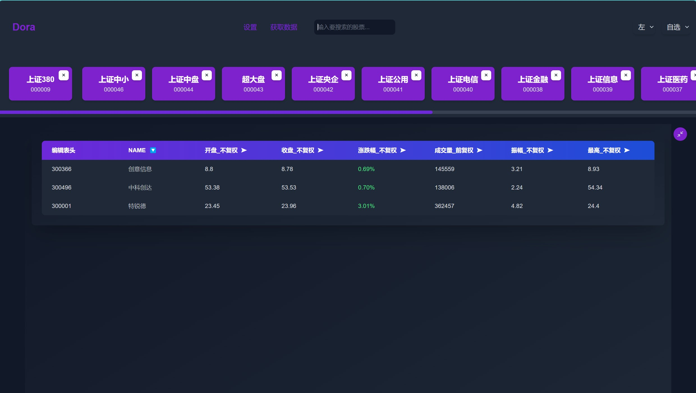
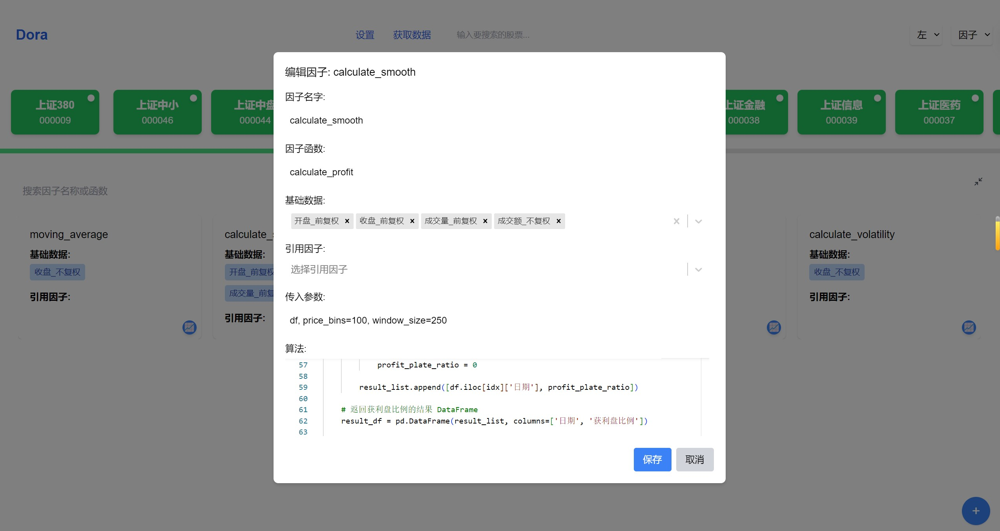
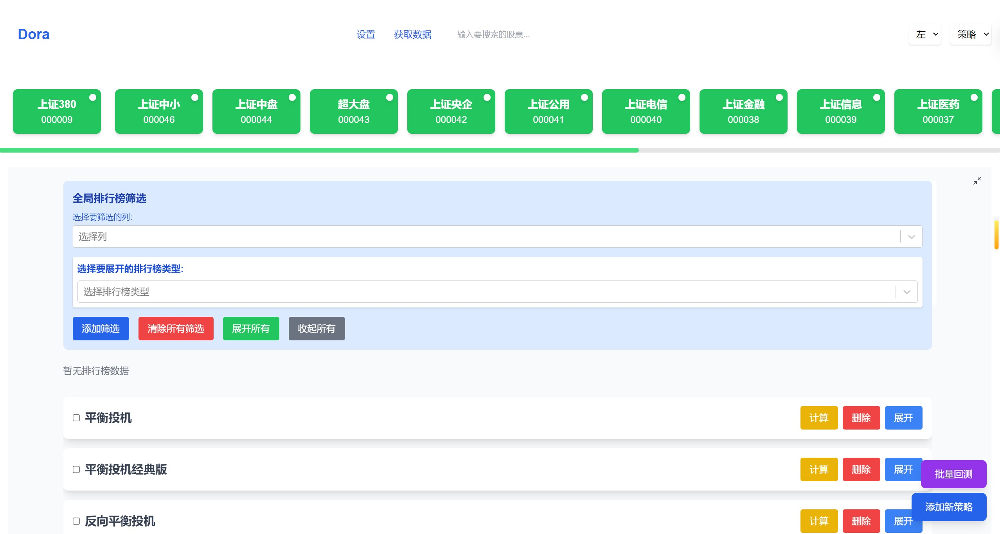

# 因子回测

以下是系统的主要功能和界面展示。

## 主界面

主界面展示了系统的整体布局，包含主要的功能模块和导航选项。

## 编辑表头

在编辑表头界面，用户可以自定义表格的列标题，设置方便的数据展示。

## 数据获取

数据获取功能允许用户通过增量更新和全量更新两种方式更新所需数据，以支持后续分析。

## 系统配置

系统配置界面提供了用户对系统参数的设置选项，确保系统能够满足特定需求。

## 主要功能

### 搜索功能

搜索功能帮助用户快速查找相关股票数据或策略。

### 因子管理

#### 因子界面

因子界面展示了现有因子的列表，并允许用户对其进行管理。

#### 因子编辑

用户可以在因子编辑界面修改因子的具体属性，如名称、值，代码等设置。

#### 添加因子

该界面允许用户创建新的因子，以丰富分析的维度。

## 策略管理

### 策略界面

策略界面展示了所有已有策略的列表，用户可以选择、编辑或删除。

### 批量回测

批量回测功能支持同时对多个策略的多个时间范围进行回测，提升效率。

### 添加策略

用户可以在此添加新的策略，定义相应的参数和条件。

### 编辑策略

编辑策略界面允许用户对已创建的策略进行修改和优化。

## 回测结果

回测结果展示了策略执行的效果和表现，帮助用户进行后续决策。

## License

本项目遵循 MIT 许可证，详情请查看 [LICENSE](LICENSE) 文件。
